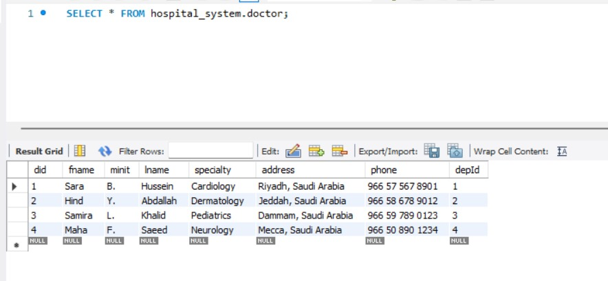
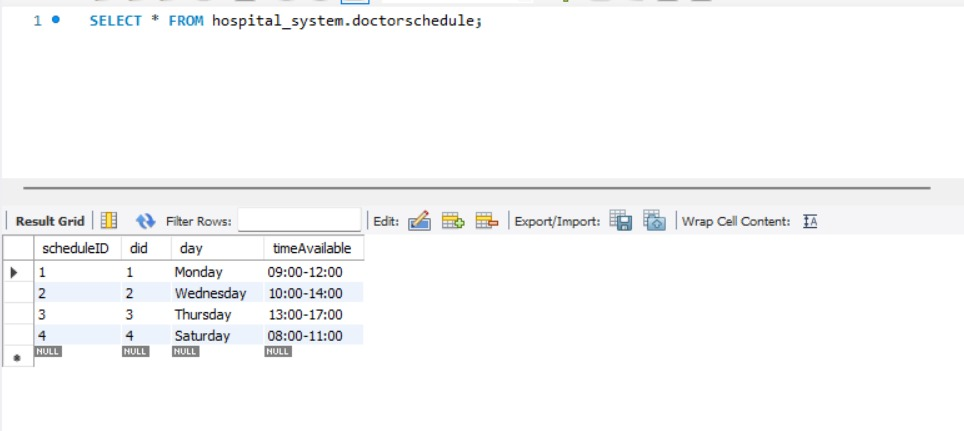
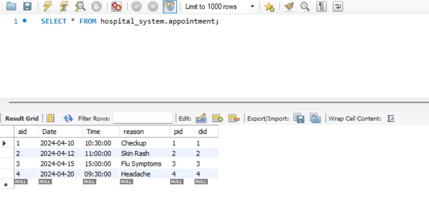
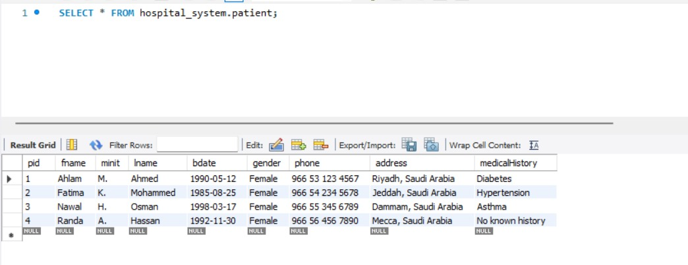
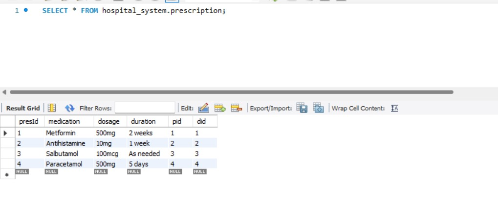

# Hospital Database Management System

A MySQL database project for managing core hospital information, including patients, doctors, departments, doctor schedules, appointments, and prescriptions.

## Project Overview

This project demonstrates relational database design and implementation using MySQL and MySQL Workbench. It includes a conceptual ER diagram, a relational model, SQL scripts for creating and populating the database, a full database dump, sample queries, and screenshots showing the implemented tables.

## Main Entities

- Patient
- Doctor
- Department
- DoctorSchedule
- Appointment
- Prescription

## Features

- Conceptual ER diagram
- MySQL Workbench relational model
- SQL schema creation
- Primary and foreign key constraints
- Sample data population
- Appointment and doctor schedule management
- Prescription records
- Full MySQL database dump
- Screenshots of implemented tables and results

## Technologies

- MySQL
- MySQL Workbench
- SQL

## Repository Structure

```text
Hospital-Database-Management-System/
├── README.md
├── sql/
│   ├── schema.sql
│   ├── populate.sql
│   ├── sample_queries.sql
│   └── Hospital_System.sql
├── diagrams/
│   ├── er-diagram.jpg
│   └── mysql-workbench-diagram.jpg
└── screenshots/
    ├── doctor-table.jpg
    ├── doctor-schedule.jpg
    ├── appointments.jpg
    ├── patient-table.jpg
    └── prescriptions.jpg
```

## Setup

### Option 1: Build from the SQL scripts

1. Open MySQL Workbench.
2. Run `sql/schema.sql` to create the database and tables.
3. Run `sql/populate.sql` to insert the sample data.
4. Run `sql/sample_queries.sql` to explore the database.

### Option 2: Import the full dump

Import `sql/Hospital_System.sql` in MySQL Workbench to restore the database structure and sample data.

## Database Design

### Conceptual ER Diagram


### MySQL Workbench Diagram


## Implementation Screenshots

### Doctor Table



### Doctor Schedule



### Appointments



### Patient Table



### Prescriptions



## Skills Demonstrated

- Relational database modeling
- SQL DDL and DML
- Primary and foreign keys
- Referential integrity
- Data population
- Database export and import
- MySQL Workbench

## Author

Sarah Almohaimeed
