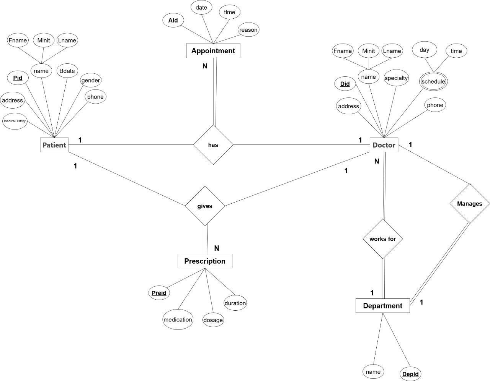
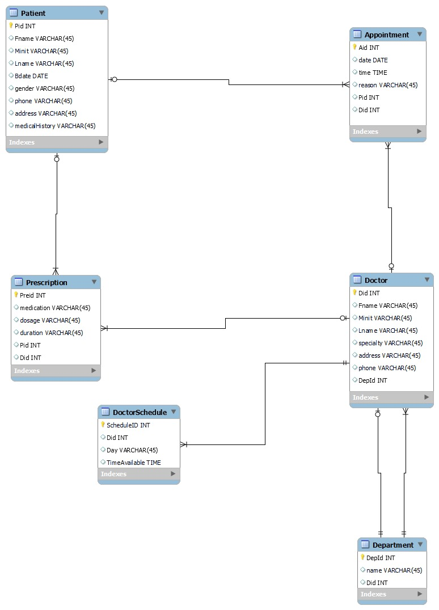

# Hospital Database Management System

A MySQL database project for managing core hospital information, including patients, doctors, departments, doctor schedules, appointments, and prescriptions.

## Project Overview

This project demonstrates relational database design and SQL implementation using MySQL. The database models the relationships between hospital entities and applies primary keys, foreign keys, and referential constraints.

## Main Entities

- Patient
- Doctor
- Department
- DoctorSchedule
- Appointment
- Prescription

## Features

- Relational database design with an ER diagram
- MySQL schema creation
- Primary and foreign key constraints
- One-to-many relationships between core entities
- Doctor schedule management
- Patient appointment records
- Prescription records
- Cascading update/delete rules where defined in the original design

## Technologies

- MySQL
- MySQL Workbench
- SQL

## Repository Structure

```text
Hospital-Database-Management-System/
├── README.md
├── sql/
│   ├── schema.sql
│   └── sample_queries.sql
└── diagrams/
    ├── er-diagram.jpg
    └── mysql-workbench-diagram.jpg
```

## Database Setup

1. Open MySQL Workbench.
2. Open `sql/schema.sql`.
3. Run the script to create the `hospital_system` database and its tables.
4. Use `sql/sample_queries.sql` to explore the database structure.

## Database Design

The project includes both a conceptual ER diagram and a MySQL Workbench relational diagram.

### Conceptual ER Diagram



### MySQL Workbench Diagram



## Skills Demonstrated

- Database modeling
- Relational schema design
- SQL DDL
- Primary and foreign keys
- Referential integrity
- MySQL Workbench

## Author

Sarah Almohaimeed
